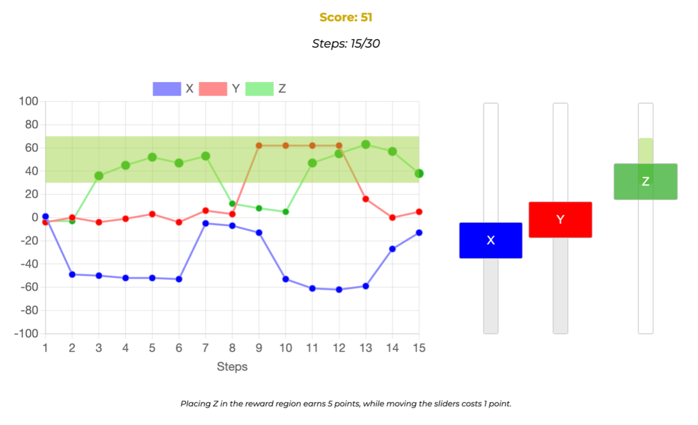

# Causal inference and learned helplessness

This repository contains the experiment code, data, analyses, and figures for the paper "Causal inference and learned helplessness" by Joshua W. Z. Hew and Neil R. Bramley (2026).

The preregistration can be found [here](https://aspredicted.org/vf52-wxvr.pdf). A demo of the task can be found [here](https://eco.ppls.ed.ac.uk/~s2144522/exp1_demo/).

__Contents__:
- [Introduction](#introduction)
- [Repository structure](#repository-structure)
- [CRediT](#credit)

## Introduction



Prolonged exposure to uncontrollable situations can cause individuals to become and remain dysfunctionally passive. This pattern, known as *learned helplessness*, is typically induced in lab settings using simple tasks, but real-world control involves complex, non-linear causal systems. In these environments, the ability to influence an outcome often diverges from the ease of achieving the specific result one *wants*. Moreover, ascribing agency to oneself is a non-trivial process that depends on prior mechanistic beliefs and counterfactual inference. To investigate these dynamics, we systematically manipulated structure, controllability, and reward prevalence while participants interacted with dynamic causal variables in real time. Whilst low levels of practical control reliably induced helpless behaviour, we found that this did not depend on reward prevalence or the accuracy of learners' causal beliefs. 


<br clear="left" />
<br clear="right" />


## Repository structure

```
├── analysis
│   ├── exp_analysis_v2.Rmd
│   ├── counterfactual_analysis_v2.Rmd
│   ├── simulation_analysis.Rmd
│   ├── figure_simulation.Rmd
│   └── causal_query_answers.csv
├── code
│   ├── exp1_main
│   ├── exp1_demo
│   ├── exp1_simulations_randomcontrol
│   └── exp1_simulations_zerocontrol
├── data
│   ├── exp_data
│   ├── control_strategy_simulated_data
│   └── figure_simulated_data
├── documents
├── figures
│   ├── analysis_figures
│   └── figure_simulation
└── videos
```

- `analysis/` contains all R scripts for data analysis and figure generation.
  - `exp_analysis_v2.Rmd` — main pre-registered and exploratory analyses
  - `counterfactual_analysis_v2.Rmd` — counterfactual intervention quality analysis
  - `simulation_analysis.Rmd` — analysis of no-control and random-control simulations
  - `figure_simulation.Rmd` — generates simulated causal system behaviour figures (Figure 1a in the paper)
- `code/` contains the JavaScript experiment code for all versions of the task.
  - `exp1_main/` — the main experiment deployed to participants via Prolific. 
  - `exp1_demo/` — a simplified demo version of the task without data collection. You can try out the task [here](https://eco.ppls.ed.ac.uk/~s2144522/exp1_demo/).
  - `exp1_simulations_randomcontrol/` — a version of the task that simulates a random-intervention control strategy.
  - `exp1_simulations_zerocontrol/` — a version of the task that simulates a no-intervention control strategy.
- `data/` contains anonymised participant and simulation data.
  - `exp_data/` — trial-level and round-level data collected from Prolific participants.
  - `control_strategy_simulated_data/` — simulated round scores for the random- and no-control benchmark strategies, used in task performance comparisons.
  - `figure_simulated_data/` — simulated causal system trajectories used to generate Figure 1a.
- `documents/` contains the manuscript and other presentation slides.
- `figures/` contains all figures from the paper, generated by the scripts in `analysis/`.
  - `analysis_figures/` — figures from the main and exploratory analyses.
  - `figure_simulation/` — figures showing simulated causal system behaviour.
- `videos/` contains screen recordings of the task under each of the four experimental conditions (high/low control × large/small reward region).

## CRediT

| Term                       	| Joshua Hew 	| Neil Bramley 	|
|----------------------------	|----------	|----------	|
| Conceptualisation          	| x         	| x         	|
| Methodology                	| x         	| x         	|
| Software                   	| x         	|          	|
| Validation                 	| x         	|          	|
| Formal analysis            	| x         	|          	|
| Investigation              	| x         	|          	|
| Resources                  	| x         	| x         	|
| Data Curation              	| x         	|          	|
| Writing - Original Draft   	| x         	|          	|
| Writing - Review & Editing 	| x         	| x         	|
| Visualisation              	| x         	|          	|
| Supervision                	|          	| x         	|
| Project administration     	| x         	| x         	|
| Funding acquisition        	|          	| x         	|
